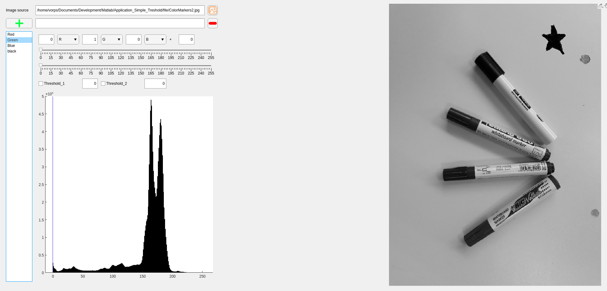

# Application_Image_Thresholding
Application permettant la segmentation d'objets sur des images couleur, basée sur un changement de base colorimétrique et par seuillage.

Overview
========
### Chargement d'une image et visualisation des différents canneaux

### Modification de la base colorimétrique pour maximiser une couleur.

### Application d'un simple ou d'un double seuillage sur le canal modifié.

